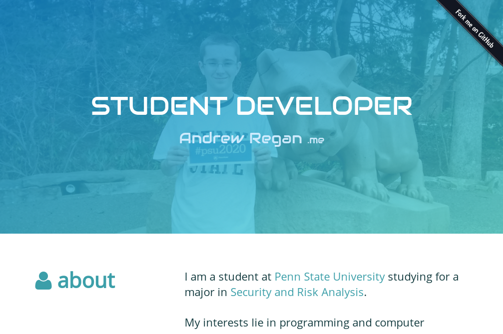

# Introduction
This is the repository for my personal resume website [andrewregan.me](https://andrewregan.me).  Feel free to fork this repository and make your own cool resume website!

## Getting Started

1. Fork this repository on GitHub!
2. Add your own images and change the text
3. Change the color scheme in `default.css`
  - Look for `.image-overlay` and change the `linear-gradient`
4. Be sure to list changes made in the readme!

## Used Assets

- **Icons** - [Font Awesome](http://fontawesome.io/)
- **Framework** - [Bootstrap](https://getbootstrap.com/)

## License
This software is licensed under the **GNU Affero General Public License Version 3**.

#### Your obligations with the source code:
- **The source code MUST be published**, *just fork this repository on GitHub!*
- Modifications must be released under the same license
- Include the License and Copyright notice with the source code
- State changes that were made to the source code
